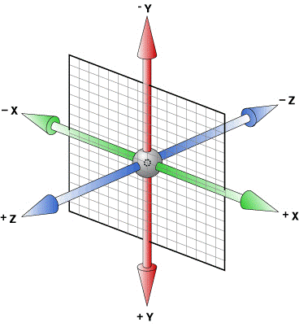

# CSS3选择器
>[w3c参考手册](http://www.w3school.com.cn/cssref/css_selectors.asp)

- 复习CSS选择器 [图](https://www.processon.com/mindmap/59cccdace4b06e9fd2f79a8b)
- 伪类、伪元素的区别和应用
案例：文字叠加效果、聊天气泡效果
- child和of-type系列选择器的区别和应用
案例：星星评分

# CSS3兼容写法

以下是几种常用前缀
-webkit
-moz
-ms
-o
先写私有的CSS3属性，再写标准的CSS3属性
**什么时候我们可以去掉一个属性的CSS3前缀呢？**
答案是，当一个属性成为标准，并且被Firefox、Chrome等浏览器的最新版普遍兼容的时候。

# CSS3字体

## @font-face
- 网页使用非安全字体
- 字体图标
可以随时更改图片的大小
占用空间很小
加载快
>案例：图标字体、iconfont、fontAwesome

# CSS3背景
- background-clip
规定背景的绘制区域 ,用来控制背景（背景色和背景图片）的显示区域  默认 border-box
- background-origin
决定背景图片的定位原点  默认 padding-box
- background-size
- background-attachment
- 多背景

# CSS3边框
## border-radius 圆角
- border-top-left-radius
- border-top-right-radius
- border-bottom-right-radius
- border-bottom-left-radius
- border-radius: 水平方向半径 / 垂直方向半径

>扩展：
1. 大值特性
	当border-radius值很大的时候只会用元素的最大的宽或高(包括border)来渲染
2. 等比例特性：垂直半径和水平半径的等比例性	
    border-radius定义的某个角的垂直半径和水平半径的比例是不会变的。
3. 相邻角的垂直（水平）半径的等比例性
    当相邻角的水平（垂直）半径和超过元素的outWidth(outHeight)时候，将按照等比例缩小半径，直至两相邻角的水平（垂直）半径和等于元素的outWidth(outHeight)
4. 在table,inline-table,table-cell中设置圆角，border-collapse = collapse无效果[案例]
>解释 border-radius:50%   和  100% 的表现：如果两个相邻的角的半径和超过了对应的盒子的边的长度，那么浏览器要重新计算保证它们不会重合。
>圆角会限制内容区域，像文字可能会被截断，轮廓(outline)不会有圆角效果
>实际的内半径相当于外半径减去相应的边框大小。相减的值中如果至少一个为为负值或零，则内半径为直角。不管怎样，相邻的两个边都会形成流畅的线条。
>学会运用圆角画各种图形

## border-image
将图片规定为包围 div 元素的边框(理解为 border-style的扩展)
[原理动画演示](border-image原理动画演示.html)
缩写语法：border-image: source slice / width outset repeat;

- border-image-source
- border-image-slice 
定义：此属性指定顶部，右，底部，左边缘的图像向内偏移，分为九个区域：四个角，四边和中间。图像中间部分将被丢弃（完全透明的处理），除非填写关键字fill
border-image-slice: number|%|fill;
- border-image-width
- border-image-outset
- border-image-repeat

# CSS3阴影
## text-shadow

- 语法：text-shadow:1px 1px 3px #ccc;   
水平偏移 垂直偏移值 模糊值 阴影的颜色
>偏移值可以是负数
>模糊值可省略（视为0）， 不能为负数
>可以写多个阴影，以逗号分隔，写在前面阴影的会盖在后面的上面
>案例：文字层叠效果、光晕效果、火焰效果

## box-shadow
- 语法：box-shadow: 2px 2px 5px 1px rgba(0, 0, 0, .6) inset;
水平偏移 垂直偏移 模糊值 阴影尺寸（外延值/内延值） 颜色 是否内阴影
> 3、4两个参数都可省略，阴影尺寸可以理解为阴影相对于原来大小的增减尺寸，可以为负数
>inset省略即是外阴影
>层级：边框>内阴影>背景图片>背景颜色>外阴影 
>多个阴影：先写的阴影显示在前面,层级高于后面的阴影 
>可以完全贴合圆角，而outline不会
>案例：三（五）道杠  应用多重边框（[蒙娜丽莎](https://codepen.io/pengteling/pen/VPqBmx)） 卷边效果

# CSS3渐变
##线性渐变
-  linear-gradient([ [ &lt;angle&gt; | to &lt;side-or-corner&gt; ] ,]? &lt;color-stop&gt;[, &lt;color-stop&gt;]+)
1、向下/向上/向左/向右/对角方向  linear-gradient(direction, color-stop1, color-stop2, ...);
2、使用角度  linear-gradient(angle, color-stop1, color-stop2...);
3、可以用在background、[border-image](https://codepen.io/team/css-tricks/pen/LVdXdM)、list-style-image (理论上 任何CSS里面可以写url(图片)的地方 可以用渐变,但是各浏览器的支持度不一样)
- repeating-linear-gradient() 
参数写法与linear-gradinet一样

>渐变的方向:可省略，默认是从上到下(to bottom 或者 180deg)。 可以是关键字或者角度，注意标准语法与前缀语法的区别（一个有to 一个无to）

>起止颜色：颜色可以跟起始值，可以是半透明色
>**怎么创建条纹？**
>"如果多个颜色过渡点的位置相同，那么就会在两个颜色之间生成一个无限小的过渡。实际效果就是，一个颜色不再会流畅地过渡到下一个颜色了，而是会突然变成下一个颜色。" — CSS Image Values Level 3
“如果某个颜色过渡点的位置小于它之前的颜色过渡点，那么该颜色过渡点的位置就会被重置为所有在它前面的颜色过渡点的最大位置。” — CSS Images Level 3
条纹以后可以这样写： linear-gradient(45deg, red 30px green 0 green 60px blue 0)
>案例：
渐变实现三（五）道杠、条纹背景、透明度渐变、自然随机条纹

##径向渐变
- background: radial-gradient(shape size at position, start-color, ..., last-color);

>默认值： ellipse farthest-corner at center center
>farthest-corner等关键字不能和半径同时出现，否则半径设置无效

>熟悉掌握多种写法

- repeating-radial-gradient
>案例：径向渐变实现圆环、透明的圆、波浪线、多圆孔（波点图）等
>了解：chorme标志、复杂图形

# CSS3转换
## 2D转换
- translate(x,y)、translateX()、translateY()
- rotate()  
Transform-origin
- scale()、 scaleX()、scaleY()
- skew()、 skewX()、skewY()
- matrix()

>扩展：
transform属性会创建局部层叠上下文 () 
transform 属性改变绝对定位子元素的包含块

## 3D转换

- translate3d() translateX()、translateY()、translateZ()
- rotate3d(x,y,z,angle) rotateX()、rotateY()、rotateZ()
- scale3d(x,y,z) scaleX()、scaleY()、scaleZ()
- matrix()  16个值的4*4矩阵
- perspective(n) 
理解 该属性设置在父元素与子元素上的区别

- perspective-origin()
观看者好像在该位置观看该元素的子元素  
>[参考资料]
(https://css-tricks.com/almanac/properties/t/transform-origin/)
(https://css-tricks.com/almanac/properties/p/perspective-origin/)
(https://css-tricks.com/almanac/properties/p/perspective/)(http://www.zhangxinxu.com/study/201209/transform-perspective-same-rotate.html)
(https://www.w3cplus.com/css3/transform-basic-property.html)

- transform-style: preserve-3d
将所有子元素呈现在3d空间中,仅对子元素有效(如果孙元素也有3d效果,那么还必须给子元素设置preserve-3d)。
- backface-visibility:hidden
定义当元素不面向屏幕时是否可见。
>用CSS3实现一个立方体
>旋转木马、3D菜单、翻书效果（进阶）、3D加载条

# CSS3过渡
- transition
- transition-property
- transition-duration
- transition-timing-function
- transition-delay

>哪些CSS属性支持过渡效果？https://www.w3.org/TR/css3-transitions/#properties-from-css-
>在线资源 贝塞尔曲线 http://cubic-bezier.com

# CSS3动画
## @keyframes
掌握语法
@keyframes animationname {keyframes-selector {css-styles;}}

## animation

简写语法：
animation: name duration timing-function delay iteration-count direction fill-mode play-state;

- animation		复合属性。检索或设置对象所应用的动画特效
- animation-name		检索或设置对象所应用的动画名称
- animation-duration		检索或设置对象动画的持续时间
- animation-timing-function		检索或设置对象动画的过渡类型
- animation-delay		检索或设置对象动画延迟的时间
- animation-iteration-count		检索或设置对象动画的循环次数
- animation-direction		检索或设置对象动画在循环中是否反向运动
- animation-play-state		检索或设置对象动画的状态
- animation-fill-mode		检索或设置对象动画时间之外的状态

难点：
animation-direction
animation-fill-mode
animation-timing-function

>animation-delay 只作用于整个动画，不是每次循环都会延迟
>animation-timing-function:steps的设置都是针对两个关键帧之间的，而非整个keyframes
>steps(1,start)=step-start开始动画时以下一帧的显示来填充动画间隔，跳过0%，表示开始时阶跃 
>steps(1,end)=step-end开始动画时以上一帧的显示来填充动画间隔，跳过100%，表示结束时阶跃
>动画反向播放时 reverse 或 alternate-reverse时  steps(1,start) 仍然是跳过0%，以下一帧的显示来填充间隔
Steps(1,end)仍然是跳过100%，以上一帧的显示来填充间隔，也就是说 无论正向反向，该参数的表现一致。

>案例
1. 无限循环案例：背景无缝滚动、圆环进度条
2. 帧动画案例：女孩跑步、燃烧的狐狸、奔跑的大侠、吉利汽车(飘絮效果)
3. 视差滚动案例：有意思的三张图片（作业）、吉利汽车（车内）(http://www.cnblogs.com/lhb25/archive/2012/03/02/30-mind-blowing-parallax-scrolling-effect-websites.html)
4. animate.css及综合应用
5. CSS3时间轴、CSS3全屏切换、体验CSS画猫咪、纯CSS画玻璃瓶里面的水母

>参考：
jquery滚动监听插件 (http://imakewebthings.com/waypoints/)
https://github.com/bas2k/jquery.appear/

# 媒体查询

@media
- 了解基本概念及用法
- 了解排他、覆盖、无线端优先、PC优先的写法
# Flex布局
容器 属性
- flex-direction: row | row-reverse | column | column-reverse;
- flex-wrap:nowrap | wrap | wrap-reverse; //换行
- flex-flow: <flex-direction> || <flex-wrap>;//以上两的缩写
- justify-content: flex-start | flex-end | center | space-between | space-around; //主轴上对齐方式
- align-items:align-items: flex-start | flex-end | center | baseline | stretch; //交叉轴上对齐方式
- align-content: flex-start | flex-end | center | space-between | space-around | stretch;  //多根轴线对齐方式

项目（容器成员） 属性
- order：<integer> //数字越小越靠前
- flex-grow:  <number>; /* default 0  放大比例*/
- flex-shrink:  <number>; /* default 1  缩小比例 */
- flex-basis:<length> | auto; /* default auto 项目本来大小 */
- flex: none | [ <‘flex-grow’> <‘flex-shrink’>? || <‘flex-basis’> ]  //以上三个的简写 auto表示(1,1,auto)，none表示(0,0,auto)
- align-self: auto | flex-start | flex-end | center | baseline | stretch; //auto继承父容器的align-items

# Grid布局

边玩游戏边学习grid: http://cssgridgarden.com/
学习资料：
https://www.w3cplus.com/css3/line-base-placement-layout.html
https://www.jianshu.com/p/d183265a8dad
http://www.css88.com/archives/8642

两种布局的总结：
– CSS Grid 适用于布局整体页面。它们使页面的布局变得非常容易，甚至可以处理一些不规则和非对称的设计。
– Flexbox 非常适合对齐元素内的内容。你可以使用 Flexbox 来定位设计上一些较小的细节问题。
– CSS Grid 适用于二维布局（行与列）。
– Flexbox 适用于一维布局（行或列）。
– 同时学习它们，并配合使用。

# Bootstrap
* less
* 利用bootstrap快速开发网站
