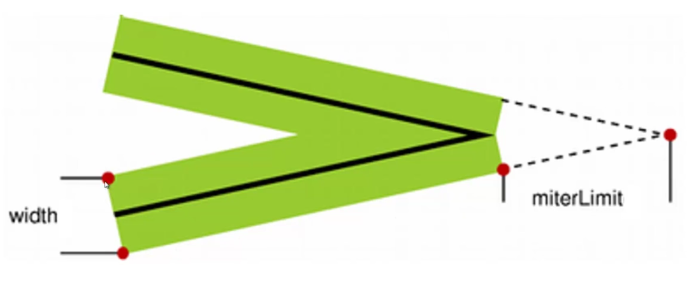
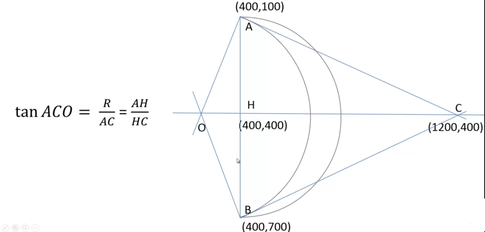

# 线条属性
## lineCap 线帽
- **butt** 默认
- **round** ： 圆头
- **square** ： 方头
>注意：线帽只对起点终点生效。在绘制封闭图形时，对于未闭合可以用lineCap来解决，一般推荐使用closePath

## lineJoin  边角类型 
- **miter** 默认值 尖角
- **bevel** 斜角
- **round** 圆角
>##### 衍生属性： miterLimit  
>- 10 number 默认值为10
>>**只有lineJoin = miter 时设置才有效**
>>如果斜接长度超过 miterLimit 的值，边角会以 lineJoin 的 "bevel" 类型来显示
>>**图示:**
>>
>>计算不直接，一般估计一个经验值。

# 画一个五角星

## 正五角星
两个半径之比约为 2.61803

# 圆弧
## arc
arc(x,y,r,startAngle,endAngle,counterclockwise)
- 案例：实现圆角距形的函数
- 2048棋盘

## arcTo
arcTo(x1,y1,x2,y2,r)
>注意 起始点x0,y0 为 moveTo ,lineTo ，或者绘制其他路径结束后的坐标
>3个点可以连着一个夹角，即辅助线
>起始点一定是x0,y0, 起点不一定是弧线的起点，终点只是相切的地方

- 案例：绘制弯月

## 二次贝塞尔曲线
context.quadraticCurveTo(x1,y1,x2,y2)
>起点就是 x0,y0, 控制点 x1,y1, 终点x2,y2
[参考](http://tinyurl.com/html5quadratic)[2](http://blogs.sitepointstatic.com/examples/tech/canvas-curves/quadratic-curve.html)
>思考：用二次贝塞尔曲线画弯月
## 三次贝塞尔曲线
context.bezierCurveTo(cp1x,cp1y,cp2x,cp2y,x,y);
>拥有两个控制点，最后一个点是结束点
>可以画波浪线、花瓣等更多灵活的图形
[参考](http://tinyurl.com/html5bezier)[2](http://blogs.sitepointstatic.com/examples/tech/canvas-curves/bezier-curve.html)
[贝塞尔曲线扫盲](http://blog.csdn.net/cdnight/article/details/48468653)
[贝塞尔曲线绘制](http://myst729.github.io/bezier-curve/)
思考：在星空下画绿地

# 渐变
## 线性渐变
- 1.创建线性渐变 var grd=ctx.createLinearGradient(x0,y0,x1,y1)
- 2.添加渐变颜色 grd.addColorStop(stop,color)  
stop 为0.0~1.0的数值
>线性渐变 如果填充线在范围之外的渐变颜色，填充会显示合适的渐变色进行填充
>如果线性渐变 填充线 没有Canvas范围大，则填充的开始和结束时 会显示渐变的开始或结束的颜色 

**练习：将星空、草地改成渐变色**

## 径向渐变
- 1.创建径向渐变 var grd=ctx.createRadialGradient(x0,y0,r0,x1,y1,r1)
- 2.添加渐变颜色 grd.addColorStop(stop,color)  

**练习：将星空改成径向渐变**

# createPattern
>fillStyle 除了颜色、渐变以外，还可以是图片、canvas、视频

- 参数：
context.createPattern([img|canvas|video],"repeat");
其中 repeat有四种值： repeat,no-repeat,repeat-x,repeat-y

# 文字渲染
- 1.context.font = "bold 40px Arial"  
- 2.context.fillText(string,x,y,[maxlenth])
- 3.context.strokeText(string,x,y,[maxlenth])
第四个参数 强行限制文字的最大宽度，可能会压缩文字的宽度
演示案例： 渐变色填充文字、图片（createPattern）填充文字
- 4.context.textAlign = "left|right|center"
- 5.context.textBaseline 
    top
    middle
    bottom
    alphabetic(默认值：拉丁字母)
    ideographic(汉字、日语等)
    hanging(印度语)
 思考： 怎么把文字写在一块画布的正中间（水平垂直居中）？
 - 6.文本的度量
 context.measureText(text).width
 >先设置好 font属性，则返回计算出来的文本宽度
 >暂时 没有height

# 阴影
- context.shadowColor
- context.shadowOffsetX
- context.shadowOffsetY
- context.shadowBlur
> shadowOffsetX、shadowOffsetY 可以为负数 阴影方向相反
> shadowBlur = 0 相当于一个投影

# 合成
- globalAlpha
使全局具有透明度
- globalCompositeOperation
绘制图像重叠时所产生的效果，globalCompositeOperation 属性设置或返回如何将一个源（新的）图像绘制到目标（已有）的图像上
理解属性值： source 源图像 代表后绘制的图形   destination 目标图像 代表先绘制的图形
     source-over 默认值 即源图像默认盖在目标图像之上
     source-atop
     source-in
     source-out
     destination-over
     destination-atop
     destination-in
     destination-out
     lighter
     copy
     xor

>理解记忆各属性值
>案例：随机圆使用globalCompositeOperation=xor/lighter
     

# clip
- context.clip()
>clip() 方法从原始画布中剪切任意形状和尺寸。
提示：一旦剪切了某个区域，则所有之后的绘图都会被限制在被剪切的区域内（不能访问画布上的其他区域）。您也可以在使用 clip() 方法前通过使用 save() 方法对当前画布区域进行保存，并在以后的任意时间对其进行恢复（通过 restore() 方法）。
>案例：探照灯

# 图像状态保存
- save()
- restore()

# 综合案例：cavnas全屏动画一
>参考资料：[adodb color](https://color.adobe.com/zh/explore/?filter=most-popular&time=month)
